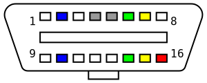

(OBD) On-Board diagnostics is self-diagnostic and reporting capability of vehicles. 

OBD-II is an improvement over OBD-I in both capability and standardization. The OBD-II standard specifies the type of diagnostic connector and its pinout, the electrical signalling protocols available, and the messaging format. It also provides a candidate list of vehicle parameters to monitor along with how to encode the data for each. (Wikipedia https://en.wikipedia.org/wiki/On-board_diagnostics) 

## SAE J1962

 

1) Manufacturer Discretion
2) BUS positive Line SAE J1850 PWM AND VPW
3) Manufacturer Discretion
4) Chassis ground
5) Signal Ground
6) CAN high (ISO 15765-4 and SAE J2284)
7) K-line (ISO 9141-2 and ISO 14230-4)
8) Manufacturer discretion
9) Manufacturer discretion
10) Bus negative Line SAE J1850 PWM only (not SAE 1850 VPW)
11) Manufacturer discretion
12) Manufacturer discretion
13) Manufacturer discretion
14) CAN LOW (ISO 15765-4 and SAE J2284)
15) L-Line (ISO 9141-2 and ISO 14230-4)
16)  Battery voltage (+12 Volt for type A connector) (+24 Volt for type B connector)

(Wikipedia https://en.wikipedia.org/wiki/On-board_diagnostics) 

# Project scope
first idea would be adding some microcontroller (arduino, node-mcu, ...) to the port with an generic connector and write the code that is needed to do whatever we want to do, but depending on the cars we need to have a total of 6 or 7 defferent protocols, that should be detectable automatic by the wires. Each car will mostly just speak one protocol

second idea is then to buy a microcontroller already doing this stuff and give a standardized usb serial protocol and then use raspberry pi or similar to read the data. This is preffered solution here to not have microcontroller software on protocol level and the transmission coding. 

## Hardware 

The idea is to use simply an *ELM* based chip. These chips are cheap and support all protocols for odb II. It comes with bluetooth or wifi but i would definitive go here with usb, since we want to connect it to the raspberry. For the power supply we can go with an easy cigarete adapter plug for the car or we take the power out of the odb as well, because it gives us access to the battery as well. And since i would like to have a single cable solution. Therefore ordering a odb splitter first to simply have two outputs. The first side we just connect our odb chip cable with usb and the other side wil be cutted for an step down converter to 5v microusb that can be put directly into that raspbery power connector. That should be all. List of hardware components:
1) raspbery pi
2) ODB-II connector (USB version)
3) ODB-II Splitter
4) 5v stepdown converter
5) microusb plug

## achritectual thinking 

so there are multiple ways to make a transmission here. first idea is to use python because we need to use it with pyodbc. So idea would be a GET-flask website think. And a setup via POSTS, actually that does the job.

But we need also to have a steady connection for transmitting real time data. So next idea is to use some websockets implemetntation. Some googleing gives socket.io or ws and others, but i will start with socket.io. lets see.

1) create server and client folder
2) in server folder do npm init 
3) in client folder create react app
